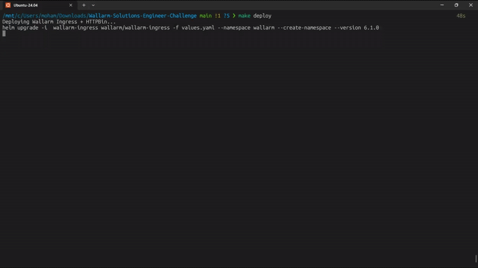
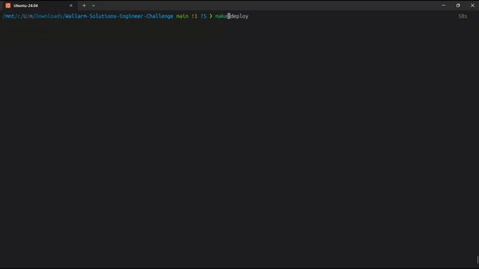
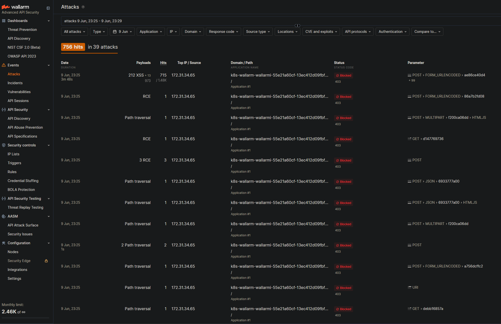
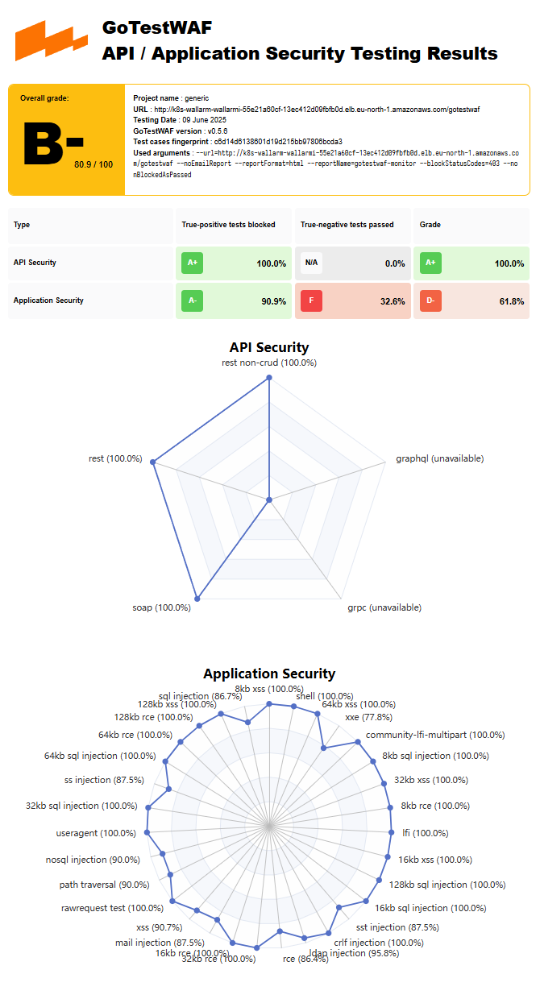

# Wallarm Solutions Engineer Technical Evaluation

## Overview

This repository contains the implementation of a Wallarm Ingress Controller deployment on AWS EKS, configured to protect a httpbin backend service. The setup demonstrates Wallarm's ability to detect and block malicious traffic using Validated attack detection using GoTestWAF.

## Architecture

The deployment consists of:
1. Wallarm Ingress Controller in the `wallarm` namespace
2. httpbin backend in the `demo` namespace
3. Validated attack detection using GoTestWAF


## Deployment

### Prerequisites

- AWS EKS cluster
- kubectl configured to access the cluster
- Helm v3 installed
- Wallarm account with API token
- Docker installed for GoTestWAF

### Installation Steps

1. **Create Wallarm API Token Secret**
```bash
# Create the secret in the wallarm namespace
kubectl create namespace wallarm
kubectl create secret generic wallarm-api-token \
  --from-literal=token='YOUR_WALLARM_TOKEN' \
  --namespace wallarm
```

2. **Deploy Using Makefile**
```bash
# Deploy everything and run tests
make all

# Deploy only
make deploy

# Run tests only
make run-test

# Clean up
make clean
```

The Makefile performs the following actions:
- Deploys Wallarm Ingress Controller using Helm
- Deploys httpbin backend
- Runs GoTestWAF tests
- Provides cleanup functionality

### Deployment Process

The following GIF demonstrates the deployment process:



## Configuration

### Wallarm Ingress Controller

The Wallarm Ingress Controller is configured with:
- Blocking mode enabled
- System nodepool targeting
- API token stored in Kubernetes secret

Key configuration in `values.yaml`:
```yaml
controller:
  wallarm:
    enabled: true
    existingSecret:
      enabled: true
      secretKey: token
      secretName: wallarm-api-token
    apiHost: api.wallarm.com
    instance: "wallarm-demo"
```

### httpbin Backend

The httpbin service is deployed in the `demo` namespace with:
- Service type ClusterIP
- Ingress resource with Wallarm annotations:
  ```yaml
  annotations:
    nginx.ingress.kubernetes.io/wallarm-mode: block
    nginx.ingress.kubernetes.io/wallarm-application: "1"
  ```
- Path `/gotestwaf` for testing

## Testing

### Running GoTestWAF

The test script `run_gotestwaf.sh` automatically:
1. Gets the LoadBalancer hostname
2. Runs GoTestWAF in a Docker container
3. Generates an HTML report in the `reports` directory



## Results

### Attack Detection
The Wallarm console shows successful attack detection and blocking:



### Test Report
The GoTestWAF report shows detailed test results:



### GoTestWAF Limitations

While GoTestWAF provides valuable insights into WAF functionality, it has limited value in real-world application security testing for several reasons:

1. **Synthetic Traffic**: 
   - Tests use predefined attack patterns
   - Doesn't reflect real-world attack scenarios
   - Lacks context-aware payloads

2. **Limited Coverage**:
   - Focuses on basic attack vectors
   - Doesn't test business logic vulnerabilities
   - Misses complex attack chains

3. **No Application Context**:
   - Tests generic endpoints
   - Doesn't understand application-specific risks
   - Can't validate business rule violations

4. **False Sense of Security**:
   - High pass rate doesn't guarantee security
   - Misses zero-day vulnerabilities
   - Doesn't test application-specific bypasses

For comprehensive security testing, GoTestWAF should be complemented with:
- Dynamic Application Security Testing (DAST)
- Static Application Security Testing (SAST)
- Interactive Application Security Testing (IAST)
- Manual security testing
- Business logic testing

## Troubleshooting

### Common Issues

1. **Node Registration Issues**
   - Verify API token is correct
   - Check API endpoint accessibility
   - Ensure proper network connectivity

2. **Traffic Flow Problems**
   - Verify LoadBalancer IP is accessible
   - Check Ingress resource configuration
   - Validate backend service health

3. **Blocking Mode Issues**
   - Check Wallarm mode configuration
   - Verify attack detection settings
   - Review blocking rules

## Documentation

### Key Resources Used
- [Wallarm Ingress Controller Documentation](https://docs.wallarm.com/admin-en/installation-kubernetes-en)
- [GoTestWAF GitHub Repository](https://github.com/wallarm/gotestwaf)

## Improvements

  - Configure TLS for all endpoints
  - Add support for multi-path ingress and more test cases
  - Integrate CI job for periodic WAF regression testing
